<div align="center">


</div>

## `>` whoami

<div align="center">



</div>

I'm a **full-stack developer** focused on building clean, scalable, maintainable software.
I care more about the quality of the code than the visibility of the username.

Currently working on modern web applications and backend systems, with a recurring detour into
system design and performance optimization.

<div align="center"></div>

## `>` stack --list --grouped

<table>
<tr>
<td valign="top" width="50%">

**`CORE`**


</td>
<td valign="top" width="50%">

**`FRONTEND`**


</td>
</tr>
<tr>
<td valign="top">

**`BACKEND & DATA`**


</td>
<td valign="top">

**`INFRA & TOOLING`**


<!-- Amazon's icon was removed from simple-icons, so shields has no `aws` logo.
     This uses an inline amber cloud glyph instead (logoColor does NOT apply to
     data-URI logos, so the amber is baked into the SVG itself). -->


</td>
</tr>
<tr>
<td valign="top" colspan="2">

**`MEDIA & SYSTEMS`**


</td>
</tr>
</table>

<div align="center"></div>

## `>` contrib --animate

<!--
  REAL DATA. Generated by .github/workflows/snake.yml from the actual
  contribution graph and served from the `output` branch.
  The ?v= is a camo cache-buster — GitHub's image proxy caches by URL, so bump
  it whenever the render changes and you need the new one picked up now.
-->

<div align="center">


</div>

## `>` sys --idle

<!--
  DECORATIVE ONLY — unlike the snake above, this represents nothing. It is an
  animated ornament, not a data visualisation, and is deliberately not labelled
  as one. Generated once by scripts/gen-dotfield.mjs and committed, so nothing
  is fetched at runtime and nothing can rate-limit, expire, or 404.
-->

<div align="center">


</div>

<div align="center"></div>

## `>` stats --live

<!--
  Generated by scripts/gen-cards.mjs straight from the GitHub API, then
  committed by .github/workflows/cache-cards.yml. Deliberately NOT a
  third-party card service: the public github-readme-stats (503
  DEPLOYMENT_PAUSED) and github-profile-trophy (402 DEPLOYMENT_DISABLED)
  instances are both offline, which is why the originals rendered broken.
-->

<div align="center">



</div>

### `>` achievements --progress

<div align="center">




</div>

<div align="center"></div>

## `>` ls ./projects

| repo | what it is | stack |
|------|-----------|-------|
| **[18-Tic-Tac-Toe](https://github.com/BigBangZeus/18-Tic-Tac-Toe)** | Dark-themed, animated Tic Tac Toe with an AI opponent and dynamic scaling | `React 19` `TypeScript` `styled-components` |
| **[Oucasted-Gamer-Site](https://github.com/BigBangZeus/Oucasted-Gamer-Site)** | High-performance portfolio & community platform for a streamer | `Web` `Performance` |

<div align="center"></div>

<div align="center">

```
┌────────────────────────────────────────────────┐
│  $ echo $ETHOS                                 │
│  > Code speaks louder than profiles.           │
└────────────────────────────────────────────────┘
```

<sub>`CHI ⟷ TPA` · built with too much coffee and not enough sleep</sub>

</div>
